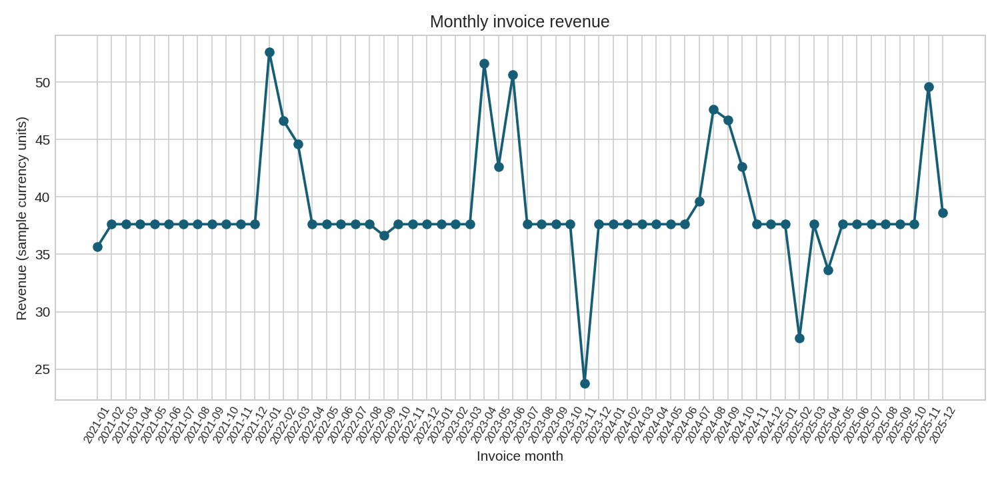
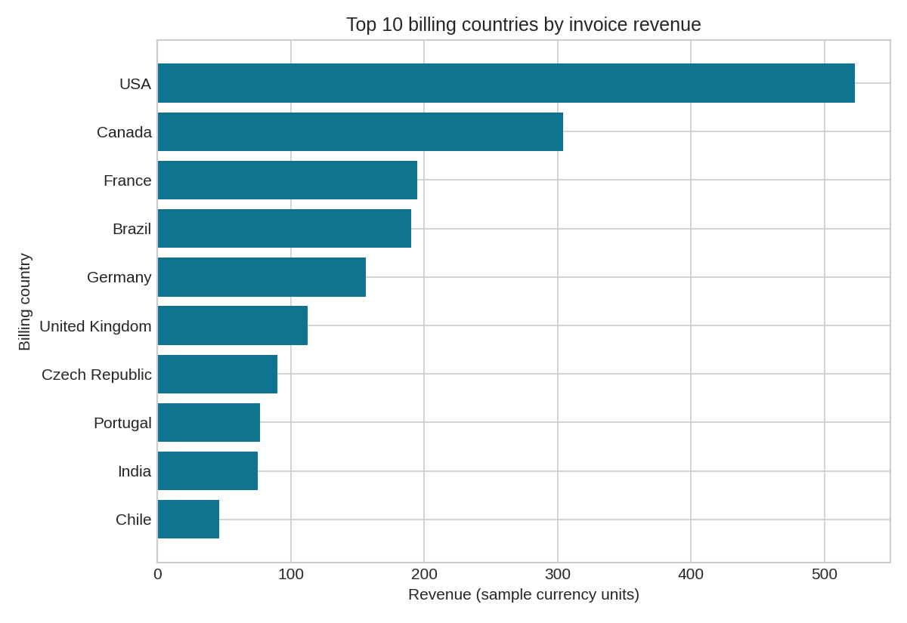
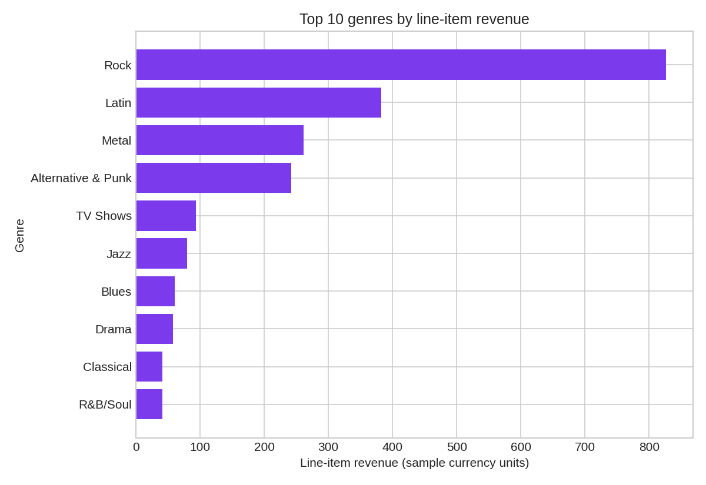

# Findings — Retail Sales Analysis

## Scope and grain

This analysis uses the Chinook **sample digital music store** database, not real commercial retail data. It covers 412 invoices/orders and 2,240 invoice-line purchases from 2021-01 through 2025-12. The analysis date is the invoice date; no inference is made outside this range. Currency units are reported as stored in the sample and are not converted or labelled as a specific real-world currency.

- **Invoice grain:** one row per order/invoice. Revenue, order count and average order value (AOV) use this table directly.
- **Invoice-line grain:** one row per purchased track on an invoice. Genre and track mix use line-item extended value (`UnitPrice × Quantity`).
- **Customer grain:** one row per customer with at least one invoice in this sample. Repeat means at least two invoices in this observed window.

## Headline results

- Invoice totals sum to **2,328.60**; line-item extended values sum to **2,328.60**. The absolute difference is **0.000000000001**, within the **0.01** currency-unit tolerance. This reconciliation supports using line items for mix while avoiding duplicated invoice totals in joins.
- There are **412 orders** and an AOV of **5.65** (`invoice revenue / invoice count`).
- The top billing country is **USA** at **523.06**, or **22.46%** of invoice revenue. The five largest countries together contribute **58.78%**.
- **Rock** is the largest genre by line-item revenue at **826.65**, or **35.50%** of line-item revenue. This is product mix, not profitability: the dataset has no cost or margin field.
- The top purchased tracks tie at **3.98**: **Gay Witch Hunt**, **Hot Girl**, **How to Stop an Exploding Man**, **Phyllis's Wedding**, **Pilot**, **The Fix**, **The Woman King**, **Walkabout**. Each appears across **2 line items**. Track-level ranking is descriptive and does not measure profit or popularity outside this sample.
- **100.00%** of the 59 customers with observed orders have at least two invoices (59/59); **100.00%** of invoices belong to those repeat customers (412/412). This describes this sample's observed customer history, not a retention or churn rate.
- The top 10 customers account for **19.38%** of invoice revenue. This is concentration within the sample, not a forecast.

## Business implications (cautious)

1. **Prioritize geographic context before action.** The United States leads the billing-country table, but the sample has no acquisition cost, delivery cost, marketing exposure or market-size denominator. Use this as a descriptive starting point for segment review, not proof that a country is more attractive.
2. **Use genre mix to guide merchandising questions.** Rock leads line-item revenue. A next step would be to inspect availability, pricing and promotion performance with a controlled comparison; this dataset cannot establish causality or profit.
3. **Treat concentration as a monitoring signal.** The top-10 share is worth tracking in a fuller customer-value review, but no churn, lifetime value or future revenue claim is supported by this one sample.

## Reproduce

From the repository root in a clean Python environment:

```bash
python -m pip install -r requirements.txt
python analysis.py
python -m unittest discover -s tests -v
```

The script executes `data/Chinook_Sqlite.sql` into an in-memory SQLite database, runs validation checks, writes CSV tables and regenerates the three PNG charts. It has no network dependency. Run it from the root so relative paths and outputs are predictable.

## Methods and checks

- SQL is documented in [`sql/analysis_queries.sql`](../sql/analysis_queries.sql), including a CTE, a window function, joins, aggregation and date grouping.
- Checks fail loudly for missing tables, duplicate primary keys, orphan foreign keys, NULL/negative numeric values in the modeled money/quantity fields, and invoice-versus-line reconciliation beyond one cent.
- The invoice/line reconciliation is based on `SUM(Invoice.Total)` versus `SUM(InvoiceLine.UnitPrice × InvoiceLine.Quantity)`. Invoice metrics never sum invoice totals after joining lines.
- CSV outputs are Excel-openable: [`monthly_sales.csv`](monthly_sales.csv), [`country_sales.csv`](country_sales.csv), [`genre_sales.csv`](genre_sales.csv), [`customer_summary.csv`](customer_summary.csv), and [`top_tracks.csv`](top_tracks.csv). Validation evidence is [`data_quality.csv`](data_quality.csv).

## Charts

- 
- 
- 

## Data source, license and caveats

Source: [lerocha/chinook-database](https://github.com/lerocha/chinook-database), specifically [`Chinook_Sqlite.sql`](https://github.com/lerocha/chinook-database/blob/master/ChinookDatabase/DataSources/Chinook_Sqlite.sql), fetched 2026-09-14. The source repository describes Chinook as a sample database; customer, invoice and music-store records are sample/fictitious educational data. They should not be presented as real retail customers or commercial performance. The original MIT-style permission notice is preserved in [`data/LICENSE.md`](../data/LICENSE.md), and source provenance is documented in [`data/provenance.md`](../data/provenance.md). The source SQL is bundled unchanged for reproducibility.

Important limitations: no cost, margin, discount, returns, tax, marketing, inventory, currency conversion or population denominators are present. `Invoice.Total` is treated as the recorded order total. Country is billing country, not necessarily customer residence or market location. Repeat-customer results are conditional on customers appearing in this sample and its observed dates; they are not cohort retention. No causal, profit, churn, or extrapolated claims are made.

## Skills demonstrated and learning context

This learning project demonstrates a reproducible workflow with SQLite, SQL joins/CTEs/window functions, pandas, matplotlib, data-quality validation, reconciliation, aggregation, CSV reporting and cautious interpretation. It is not a claim of employment, certification or prior professional experience. **Learning project prepared with AI assistance; review, reproduce, and adapt before presenting.**
